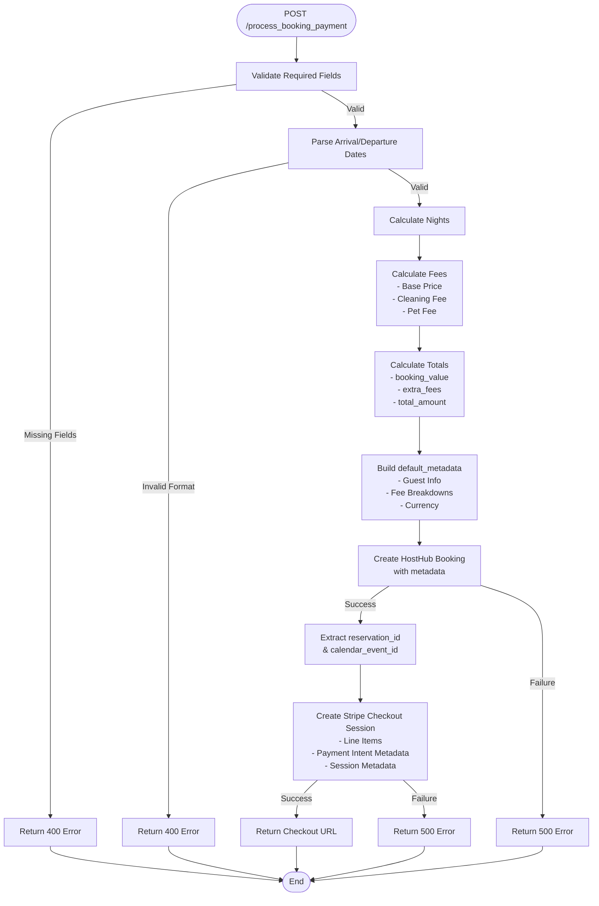

## Flowchart: Booking Creation Process

```mermaid
flowchart TD
    Start([POST /process_booking_payment]) --> Validate[Validate Required Fields]
    Validate -->|Missing Fields| Error1[Return 400 Error]
    Validate -->|Valid| ParseDates[Parse Arrival/Departure Dates]
    
    ParseDates -->|Invalid Format| Error2[Return 400 Error]
    ParseDates -->|Valid| CalcNights[Calculate Nights]
    
    CalcNights --> CalcFees[Calculate Fees<br/>- Base Price<br/>- Cleaning Fee<br/>- Pet Fee]
    
    CalcFees --> CalcTotals[Calculate Totals<br/>- booking_value<br/>- extra_fees<br/>- total_amount]
    
    CalcTotals --> BuildMetadata[Build default_metadata<br/>- Guest Info<br/>- Fee Breakdowns<br/>- Currency]
    
    BuildMetadata --> CreateBooking[Create HostHub Booking<br/>with metadata]
    
    CreateBooking -->|Success| GetIDs[Extract reservation_id<br/>& calendar_event_id]
    CreateBooking -->|Failure| Error3[Return 500 Error]
    
    GetIDs --> CreateStripe[Create Stripe Checkout Session<br/>- Line Items<br/>- Payment Intent Metadata<br/>- Session Metadata]
    
    CreateStripe -->|Success| ReturnURL[Return Checkout URL]
    CreateStripe -->|Failure| Error4[Return 500 Error]
    
    ReturnURL --> End([End])
    Error1 --> End
    Error2 --> End
    Error3 --> End
    Error4 --> End
```