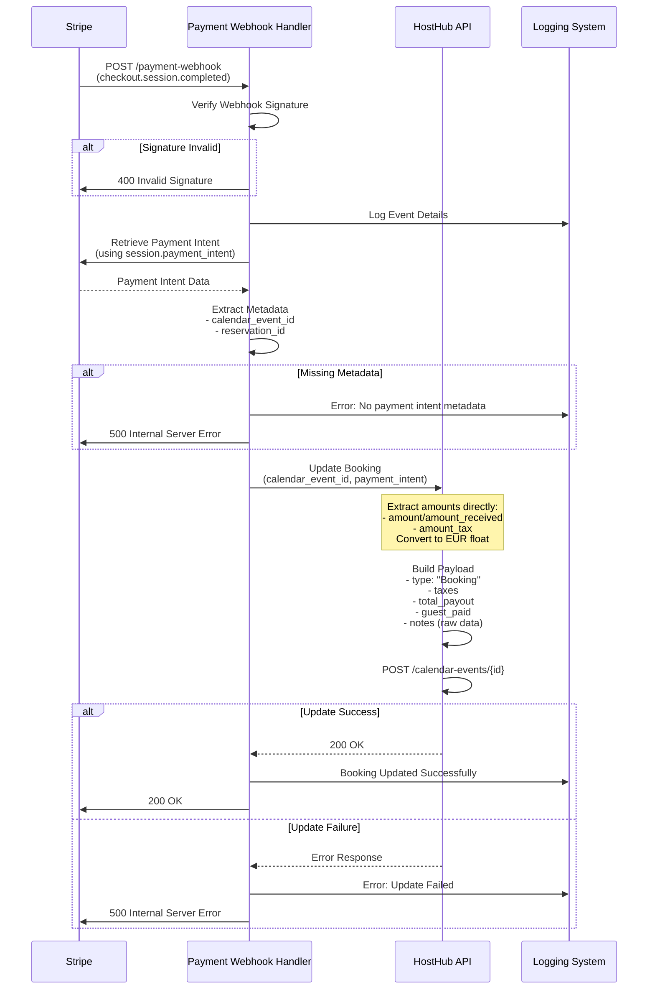

## Sequence Diagram: Payment Webhook Processing

```mermaid
sequenceDiagram
    participant Stripe
    participant Webhook as Payment Webhook Handler
    participant HostHub as HostHub API
    participant Log as Logging System

    Stripe->>Webhook: POST /payment-webhook<br/>(checkout.session.completed)
    
    Webhook->>Webhook: Verify Webhook Signature
    
    alt Signature Invalid
        Webhook->>Stripe: 400 Invalid Signature
    end
    
    Webhook->>Log: Log Event Details
    
    Webhook->>Stripe: Retrieve Payment Intent<br/>(using session.payment_intent)
    Stripe-->>Webhook: Payment Intent Data
    
    Webhook->>Webhook: Extract Metadata<br/>- calendar_event_id<br/>- reservation_id
    
    alt Missing Metadata
        Webhook->>Log: Error: No payment intent metadata
        Webhook->>Stripe: 500 Internal Server Error
    end
    
    Webhook->>HostHub: Update Booking<br/>(calendar_event_id, payment_intent)
    
    Note over HostHub: Extract amounts directly:<br/>- amount/amount_received<br/>- amount_tax<br/>Convert to EUR float
    
    HostHub->>HostHub: Build Payload<br/>- type: "Booking"<br/>- taxes<br/>- total_payout<br/>- guest_paid<br/>- notes (raw data)
    
    HostHub->>HostHub: POST /calendar-events/{id}
    
    alt Update Success
        HostHub-->>Webhook: 200 OK
        Webhook->>Log: Booking Updated Successfully
        Webhook->>Stripe: 200 OK
    else Update Failure
        HostHub-->>Webhook: Error Response
        Webhook->>Log: Error: Update Failed
        Webhook->>Stripe: 500 Internal Server Error
    end
```
